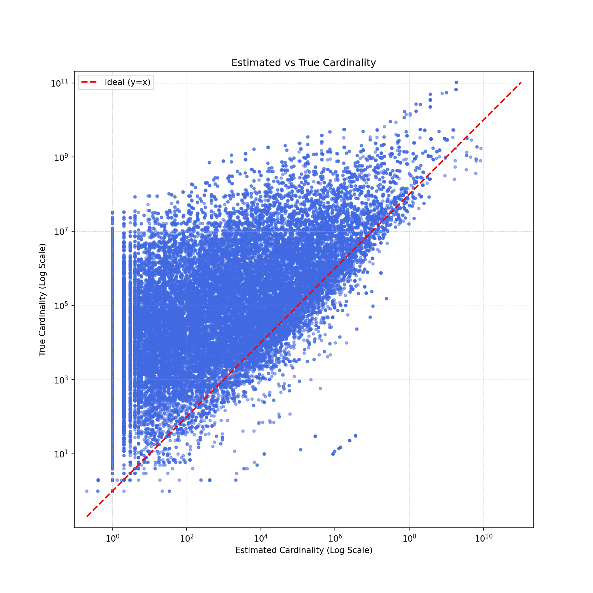
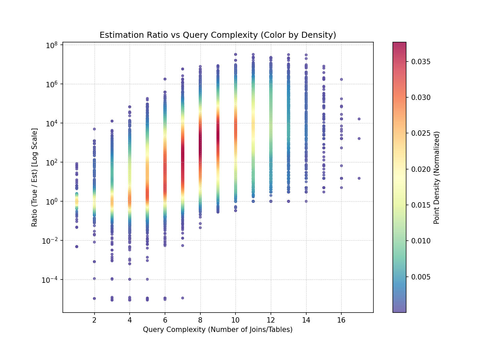
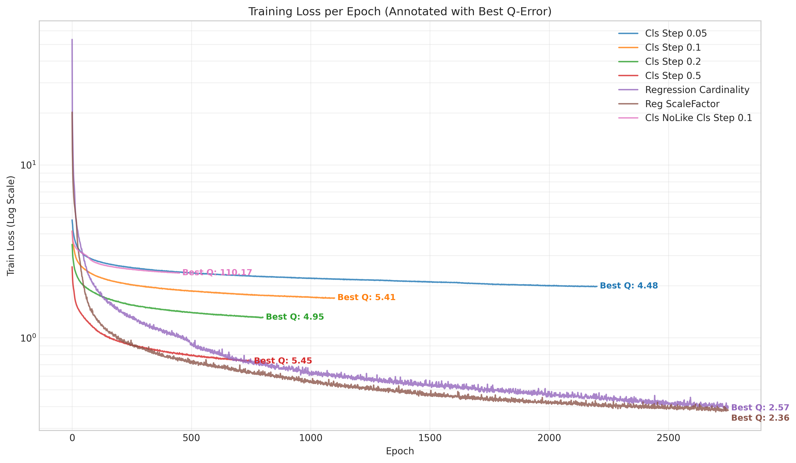
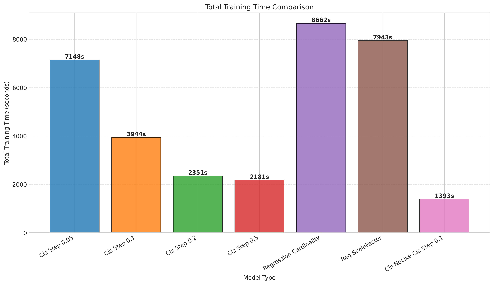
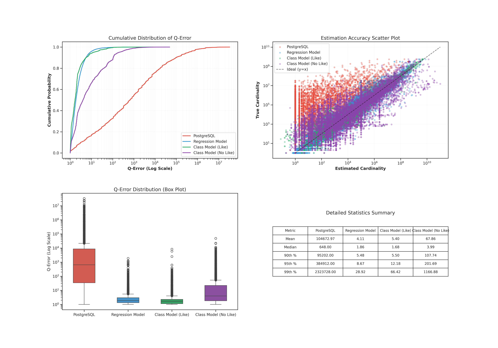
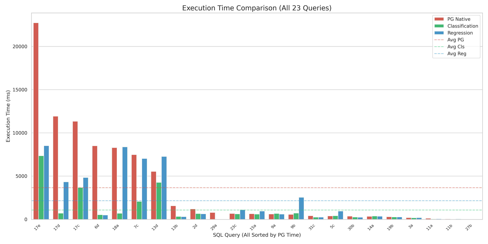

# 基于机器学习与强化学习的数据库基数估计与查询优化研究

本项目致力于解决传统数据库系统中基数估计（Cardinality Estimation）准确度不足的问题，并进一步结合强化学习（Reinforcement Learning, RL）构建高效的查询优化器。

## 1. 背景与问题：基数估计的偏差

在数据库查询优化（Query Optimization）中，基数估计的准确度严重不足，已成为主要瓶颈。

### 1.1 偏差分布特征
我们在 JOB (Join Order Benchmark) 数据集的 113 个查询执行过程中，收集了涉及基数估计的子查询数据。图一展示了真实基数与预估基数的偏差分布（真实基数/预估基数）。

  

* **严重失真**：基数估计严重失真，且大多**严重低估**。
* **无规律性**：这种误差没有明显的规律，普通函数难以拟合。

### 1.2 误差与复杂度的关系
图二展示了基数估计误差与查询复杂度（表连接数量）的关系。

  

* **无关性**：误差与查询复杂度没有明显关系。即使在固定单一查询复杂度的情况下，基数估计误差的变化依然很大。

---

## 2. 核心方法：基数修正分类模型

为了解决现有基数预测回归模型（直接预测数值）存在的训练难收敛、泛化能力差等问题，本项目提出了**基数修正分类模型**。

### 2.1 模型思想
* **输入**：`SELECT COUNT()` 开头的 SQL 语句。
* **输出**：一个**缩放因子（Scaling Factor）**，而非直接的基数值。
* **核心逻辑**：`理想缩放因子 * 数据库原生预估基数 = 真实基数`。
* **优势**：利用了“专家基数估计器”（数据库原生优化器）已有的部分知识，模型只需学习错误的特性，从而拥有更快的收敛速度。

### 2.2 离散化缩放因子
模型输出采用对数均匀分布（Log Scale）生成的离散类别，例如 `[0.001, ..., 1000, 100000]`。这种设计天然适配数据库基数估计“**严重低估，轻微高估**”的特点，兼顾了对小数值的精细区分和对大数值的宏观覆盖。

### 2.3 关键优化：LIKE 谓词处理
针对复杂查询中频繁出现的 `LIKE` 模糊匹配，我们引入了专门的特征工程：
* 使用 **52位 One-hot 编码**（代表 a-z, A-Z）。
* 若对应字母出现在 LIKE 谓词中则置为 1，否则为 0。
* **效果**：尽管这种匹配方式比实际的 LIKE 宽松，但相比完全忽略 LIKE 谓词，该方法能**显著提升模型对复杂文本匹配的感知能力**。

---

## 3. 模型训练与效果评估

### 3.1 训练效率
对比不同 Step（步长）的分类模型与回归模型：

  
  

* **收敛速度**：分类模型显著快于回归模型。Step 越大（分类越少），训练越快。
* **结论**：分类模型可以显著降低模型训练难度，以更少的时间获得模型。

### 3.2 准确性评估 (Q-Error)
我们对比了 PostgreSQL 原生方法、回归模型、分类模型（处理/不处理 LIKE）的表现：

  

* **准确性飞跃**：机器学习方法的平均 Q-Error 维持在个位数（4.11 - 5.40），而 PostgreSQL 高达 10 万级。
* **LIKE 的重要性**：不处理 LIKE 谓词的分类模型，平均 Q-Error 从 5.40 恶化至 67.86，证明了**显式特征提取逻辑对于处理复杂谓词至关重要**。
* **最佳平衡**：`Class Model (Like, Step=0.1)` 在训练效率和预测质量之间取得了最佳平衡。

---

## 4. 数据库集成与执行性能

我们将模型注入到数据库动态规划（DP）过程中。针对分类模型，设计了**“影子基数” (Shadow Cardinality)** 机制，以防止误差在 DP 过程中被错误累积放大。

### 4.1 执行时间对比
在 JOB 查询集上的平均执行时间表现：**分类模型 (绿色) > 回归模型 (蓝色) > PG 原生 (红色)**。

  

### 4.2 为什么回归模型精度高但执行慢？
上述结果中，9b有一个看似反常的结果：回归模型对应的查询计划带来了严重的性能回退。究其原因是，尽管回归模型在绝对误差（Q-Error）上略优，但在**保序性（Rank Correlation）**上表现最差：
下面是9b相关基数的保序性测试：

| 模型 | Kendall's Tau (保序性) | 说明 |
| :--- | :--- | :--- |
| **PG Estimate** | **0.8588** | 原生方法本身具备良好的相对大小关系判断能力。 |
| **CLI Model** | 0.8052 | 分类模型非常接近 PG，保留了大部分相对顺序信息。 |
| **Reg Model** | 0.5899 | **表现最差**，极易导致优化器选错 Join Order。 |

---

## 5. 进阶优化：强化学习 (RL) Pipeline

为了解决动态规划（DP）在大表连接（NP-Hard）时的耗时问题，以及 ML 模型频繁交互带来的通信开销，我们引入了强化学习优化器。

### 5.1 三种模式对比
* **Mode 1: Native (PG 原生)**：基准线。
* **Mode 2: ML-Comm Only (仅 ML 基数)**：虽然找到了质量最好的执行计划（平均执行仅 2.2s），但**规划时间是灾难性的**（平均 15s），主要源于 Python<->PG 的频繁通信。
* **Mode 3: RL Pipeline (RL + ML)**：使用 RL 锁定 Join Order 进行**剪枝**，减少搜索空间。

### 5.2 性能结果

  
  
  

* **10倍性能提升**：RL Pipeline (Mode 3) 的总耗时约为 Native (Mode 1) 的 **10% (0.10x)**。
* **解决慢查询**：极其有效地解决了长尾慢查询问题（消灭了 600s 的执行案例）。
* **规避通信开销**：通过 RL 剪枝，将 Mode 2 高达 15s 的规划时间压回到了 **0.4s**。

### 5.3 结论
成功兼顾了 ML 基数估计带来的执行红利与 RL 剪枝带来的规划效率，是极具性价比的优化方案。
